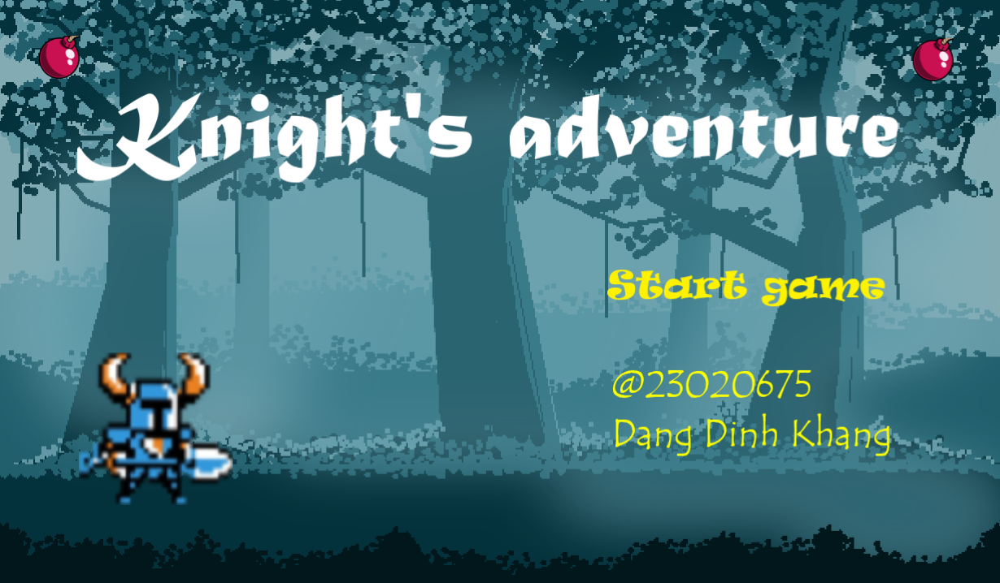
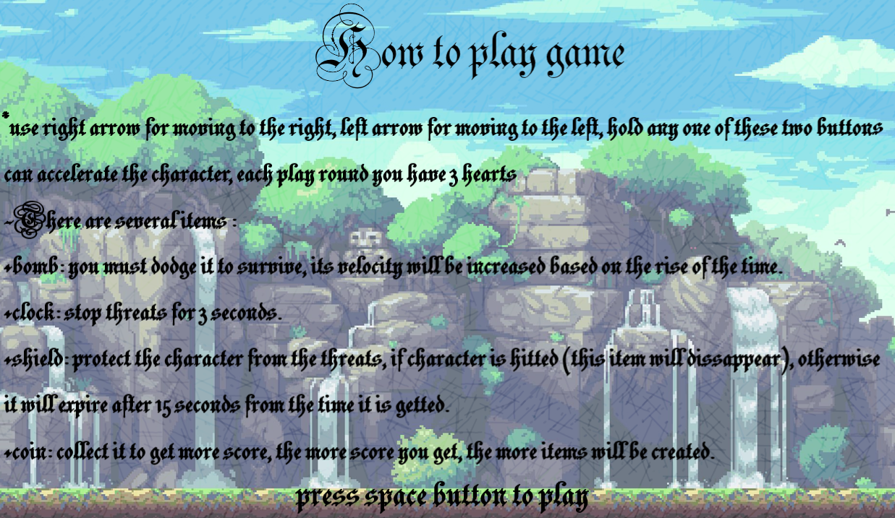
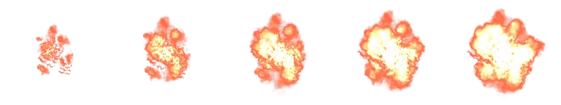

# INTRODUCTION:
- Họ và tên: Đặng Đình Khang - K68J
- MSV: 23020675
- Game: Knight's adventure

# Cách tải game:
- Bước 1: Truy cập vào đường link google drive sau : 
- Bước 2: Tải file .rar/.zip về máy, sau đó giải nén thành folder
- Bước 3: Vào folder đã giải nén, bấm file "main.exe" để chạy game

# DESCRIPTION:
## Giới thiệu về nội dung của game:

    - Game là thể loại endless game (chỉ kết thúc khi nhân vật thua) và tính điểm
    - Nhân vật sẽ phải di chuyển để né tránh chướng ngại (bom) và thu thâp tiền vàng
    để tích điểm, tốc độ của chướng ngại sẽ tăng dần theo thời gian. Bên cạnh đó nhân 
    vật sẽ có thể thu thập được các buff sức mạnh như : 
    + đồng hồ (ngưng động thời gian)
    + khiên (bảo vệ khỏi chướng ngại, chỉ biến mất khi va chạm với chướng ngại). Mỗi lượt 
    chơi nhân vật sẽ có 3 mạng, khi hết mạng thì sẽ thua cuộc.
    - Game có sử dụng hình ảnh lôi cuốn kết hợp cùng đồ họa âm thanh, điều chỉnh độ khó theo 
    thời gian và các buff cho người chơi sẽ khiến game trở nên sinh động, hấp dẫn
    
## Cách thức chơi game:

|Key   |Function      |
|:---:   |:---:           |
|<     |move to left|
|>   |move to right          |

    - Người chơi sử dụng hai nút mũi tên, sang trái "<" và sang phải ">" để di chuyển 
    nhân vật qua lại, giữ nút để có thể di chuyển liên tục.
    - Sử dụng menu: ở đầu chương trình bấm nút "start game" để vào game, đọc kĩ hướng dẫn 
    chơi game sau khi kết thúc lượt chơi có thể chọn "restart game" hoặc "exit".

## Các thành phần trong game:

- Menu game :

- Hướng dẫn chơi game :

- Ảnh nền :

- Menu kết thúc : 

- Nhân vật chính : 

- Threat (quả bom) :

- Tiền :

- Đồng hồ (buff) :

- Khiên :

- Hiệu ứng khiên :

- Mạng :

- Vụ nổ :

## Kiến thức sử dụng:
    + vector 
    + class
    + truyền tham chiếu, con trỏ
    + lưu lại điểm cao trong file 
    + cách sử dụng các cấu trúc đồ họa game trong SDL2
    + Edit ảnh cơ bản bằng Paint, Paint3D, lấy hình ảnh nhân vật, cắt ghép từ Google
    + Sử dụng âm thanh trong game, tạo menu.
- Nguồn tham khảo:
    +Youtue: https://www.youtube.com/@PhatTrienPhanMem123AZ
    +Lazyfoo.
    +Video cô Minh Châu.

    