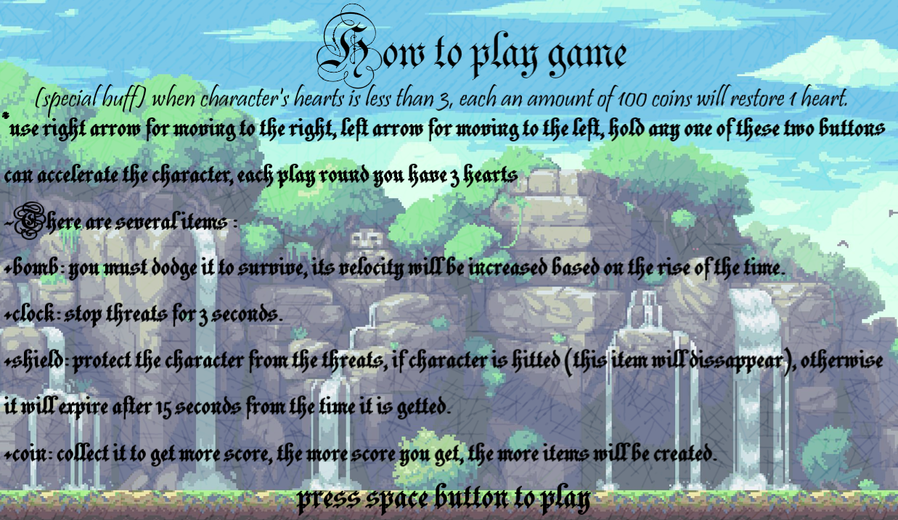

# *Knight's adventure*

- [*Knight's adventure*](#knights-adventure)
- [INTRODUCTION:](#introduction)
- [Cách tải game:](#cách-tải-game)
- [Link youtube:](#link-youtube)
- [DESCRIPTION:](#description)
  - [1.Giới thiệu về nội dung của game:](#1giới-thiệu-về-nội-dung-của-game)
  - [2.Cách thức chơi game:](#2cách-thức-chơi-game)
  - [3.Các thành phần trong game](#3các-thành-phần-trong-game)
    - [Nhân vật chính : Bạn sẽ điều khiển chàng kiếm sĩ cầm xẻng cute hột me này.](#nhân-vật-chính--bạn-sẽ-điều-khiển-chàng-kiếm-sĩ-cầm-xẻng-cute-hột-me-này)
    - [Threat (quả bom) : Dính bom sẽ bị mất 1 mạng, khi hết 3 mạng sẽ thua cuộc](#threat-quả-bom--dính-bom-sẽ-bị-mất-1-mạng-khi-hết-3-mạng-sẽ-thua-cuộc)
    - [Tiền : Tích lũy tiền để lấy buff](#tiền--tích-lũy-tiền-để-lấy-buff)
    - [Đồng hồ (dừng thời gian trong vòng 3-5 giây) :](#đồng-hồ-dừng-thời-gian-trong-vòng-3-5-giây-)
    - [Khiên (ăn icon khiên để có được hiệu ứng):](#khiên-ăn-icon-khiên-để-có-được-hiệu-ứng)
    - [Hiệu ứng khiên (bảo vệ nhân vật khỏi bom):](#hiệu-ứng-khiên-bảo-vệ-nhân-vật-khỏi-bom)
    - [Mạng (số mạng của nhân vật, mặc định là 3 mạng):](#mạng-số-mạng-của-nhân-vật-mặc-định-là-3-mạng)
    - [Vụ nổ (xuất hiện khi nhân vật va chạm vào bom):](#vụ-nổ-xuất-hiện-khi-nhân-vật-va-chạm-vào-bom)
  - [4.Cách chơi game:](#4cách-chơi-game)
    - [Menu game : Di chuột và nhấn chuột trái vào nút "start game"](#menu-game--di-chuột-và-nhấn-chuột-trái-vào-nút-start-game)
    - [Hướng dẫn chơi game : Đọc kĩ hướng dẫn chơi game rồi bấm nút "space" để bắt đầu](#hướng-dẫn-chơi-game--đọc-kĩ-hướng-dẫn-chơi-game-rồi-bấm-nút-space-để-bắt-đầu)
    - [Trong game: Di chuyển né bom, ăn tiền, ăn buff.](#trong-game-di-chuyển-né-bom-ăn-tiền-ăn-buff)
    - [Menu kết thúc: Bạn có thể xem điểm cao nhất qua các lượt chơi, có thể restart hoặc exit game](#menu-kết-thúc-bạn-có-thể-xem-điểm-cao-nhất-qua-các-lượt-chơi-có-thể-restart-hoặc-exit-game)
  - [5.Kiến thức sử dụng:](#5kiến-thức-sử-dụng)
  - [6.Về soure code:](#6về-soure-code)
  - [7.Nguồn tham khảo:](#7nguồn-tham-khảo)
  - [8. Hướng phát triển:](#8-hướng-phát-triển)
- [Conclusion:](#conclusion)

***
# INTRODUCTION:
- Họ và tên: Đặng Đình Khang - K68J
- MSV: 23020675
- Game: Knight's adventure
***
# Cách tải game:
- Cách 1:
  - Bước 1: Truy cập vào đường link google drive sau : https://drive.google.com/file/d/1AwNtParOPfFHrJsjXTB9K0VMOsjRYDBf/view?usp=sharing
  - Bước 2: Tải file .rar/.zip về máy, sau đó giải nén thành folder
  - Bước 3: Vào folder đã giải nén, bấm file "main.exe" để chạy game
  
- Cách 2: Clone my repo, sau đó vào file main.exe để chạy

***
# Link youtube:
- 
***
# DESCRIPTION:

## 1.Giới thiệu về nội dung của game:

    - Game là thể loại endless game (chỉ kết thúc khi nhân vật thua) và tính điểm.
    - Nhân vật sẽ phải di chuyển để né tránh chướng ngại (bom) và thu thâp tiền vàng
    để tích điểm, tốc độ của chướng ngại sẽ tăng dần theo thời gian.
    - Game có sử dụng hình ảnh lôi cuốn kết hợp cùng đồ họa âm thanh, điều chỉnh độ khó theo 
    thời gian và các buff cho người chơi sẽ khiến game trở nên sinh động, hấp dẫn.

***
## 2.Cách thức chơi game:

|Key   |Function      |
|:---:   |:---:           |
|<     |move to left|
|>   |move to right          |

    - Người chơi sử dụng hai nút mũi tên, sang trái "<" và sang phải ">" để di chuyển 
    nhân vật qua lại, giữ nút để có thể di chuyển liên tục.
    - Sử dụng menu: ở đầu chương trình bấm nút "start game" để vào game, đọc kĩ hướng dẫn 
    chơi game sau khi kết thúc lượt chơi có thể chọn "restart game" hoặc "exit".

***
## 3.Các thành phần trong game

### Nhân vật chính : Bạn sẽ điều khiển chàng kiếm sĩ cầm xẻng cute hột me này.

***

### Threat (quả bom) : Dính bom sẽ bị mất 1 mạng, khi hết 3 mạng sẽ thua cuộc

     

***
### Tiền : Tích lũy tiền để lấy buff

***

### Đồng hồ (dừng thời gian trong vòng 3-5 giây) :

***
### Khiên (ăn icon khiên để có được hiệu ứng):

***
### Hiệu ứng khiên (bảo vệ nhân vật khỏi bom):

***
### Mạng (số mạng của nhân vật, mặc định là 3 mạng):

***

### Vụ nổ (xuất hiện khi nhân vật va chạm vào bom):

***

## 4.Cách chơi game: 

### Menu game : Di chuột và nhấn chuột trái vào nút "start game"

***
### Hướng dẫn chơi game : Đọc kĩ hướng dẫn chơi game rồi bấm nút "space" để bắt đầu

***

### Trong game: Di chuyển né bom, ăn tiền, ăn buff. 
- Chú ý đến các buff rơi ra (đồng hồ, khiên), đặc biệt là buff hồi mạng khi số vàng tích lũy đạt được 100

***
### Menu kết thúc: Bạn có thể xem điểm cao nhất qua các lượt chơi, có thể restart hoặc exit game

***
## 5.Kiến thức sử dụng:
    + vector (lưu trữ số mạng, sản sinh các quả bom) .
    + class (khởi tạo các đối tượng) .
    + vòng lặp lồng nhau. 
    + chia file.
    + truyền tham chiếu, con trỏ, quản lý và cấp phát bộ nhớ. 
    + sử dụng frametime và SDL_Getticks() để duy trì sự mượt mà cho game.
    + lưu lại điểm cao trong file.
    + cách sử dụng các cấu trúc đồ họa game trong SDL2.
    + Edit ảnh cơ bản bằng Paint, Paint3D, lấy hình ảnh nhân vật, cắt ghép từ Google.
    + Sử dụng âm thanh, hiệu ứng trong game, tạo menu.
    + Check va chạm giữa nhân vật và quả bom.
    + Sử dụng các biến để thay đổi tốc độ của quả bom sẽ tăng dần theo thời gian và độ
     khó của game sẽ ngày càng cao, mỗi lần trúng bom, điểm tích lũy để lấy buff sẽ bị 
     trừ về 0. Do vậy, càng trúng bom nhiều, buff sẽ càng ít xuất hiện.

***
## 6.Về soure code:
- File **main.cpp**: xử lý các sự kiện logic trong game (xử lý va chạm, sản sinh bom, xử lý buff, ....), bao gồm hàm khởi tạo menu, end game và khởi tạo các object, ghi file, cập nhật điểm.

- Các class chính bao gồm :
  - File **object.h/cpp** : xử lý về phần kỹ thuật cho game (load ảnh, load text, ...) .
  - File **player.h/cpp** : khởi tạo class character, xử lý về tọa độ, hình ảnh của nhân vật .
  - File **treasure.h/cpp** : khởi tạo tiền vàng, xử lý về tọa độ, sản sinh ra tiền bằng hàm **rand()** .
  - File **threat.h/cpp** : khởi tạo quả bom, xử lý về tọa độ, hình ảnh và sinh ra bom .
  - File **shield.h/cpp** : khởi tạo khiên, tạo ra khiên tiếp theo sau khi đạt điều kiện để lấy buff.
  - File **effectshield.h/cpp** : dùng để tạo hiệu ứng khiên cho nhân vật.
  - File **explosion.h/cpp** : dùng để tạo ra vụ nổ, load các frame để tạo ra hiệu ứng sinh động .
  - File **life.h/cpp** : dùng để khởi tạo mạng cho nhân vật, sẽ thay đổi tương ứng với số mạng hiện có.
  - File **clocktime.h/cpp** : khởi tạo đồng hồ ngưng đọng thời gian.
  - File **sources.h/cpp** : dùng chung cho các class, khai báo kích thước cửa sổ, tốc độ của nhân vật, quả bom, hàm check va chạm của các đối tượng, khai báo hiệu ứng âm thanh, text.
  

***
## 7.Nguồn tham khảo: 
- Video của cô Minh Châu (học làm quen với sdl, một số khởi tạo cơ bản)
- Kênh youtube phát triển phần mềm 123az (Học cách chia file, tạo lớp đối tượng)
- Lazyfoo (lấy sự kiện chuột, âm thanh, xử lý va chạm)
- Tham khảo qua project của các anh chị khóa trước trên youtube (snake AI, ...)
- Âm thanh, hình ảnh, font chữ (lấy trên google và chọn lọc từ web itch.io)
***
## 8. Hướng phát triển:
- Tạo vũ khí tấn công cho nhân vật để tiêu diệt bom trong phạm vi nhất định (đã có dự định nhưng vẫn chưa hoàn thành được)
- Sau khi đạt đến 1 số điểm nhất định sẽ chuyển màn để đánh nhau với boss (gần giống thể loại game bắn gà)
- Thêm 1 số buff ví dụ : giấy phép (làm giảm tốc độ của quả bom)
***
# Conclusion:
- Đây là game đầu tay với ý tưởng về hiệp sĩ phiêu lưu của em, dù đã gặp khá nhiều khó khăn trong giai đoạn đầu về cả mặt ý tưởng lẫn logic game và các kĩ thuật hình ảnh với sdl dần dần em đã học hỏi và khám phá ra nhiều điều thú vị với việc lập trình có thể đem lại. 
- Em cảm nhận bản thân đã cải thiện về cách tư duy để hoàn thiện 1 dự án nói chung, cách tiếp cận thú vị từ nhiều phía có thể giải quyết vấn đề 1 các hiệu quả .
- Em xin cảm ơn thầy Lê Đức Trọng, thầy Trần Trường Thủy cùng các anh mentor đã support rất nhiệt tình cho em.

    